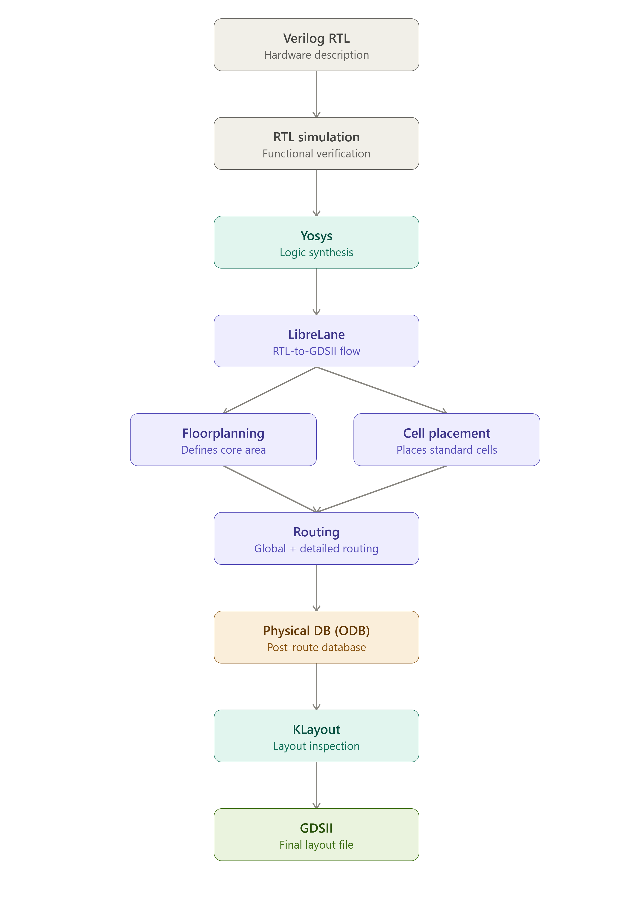
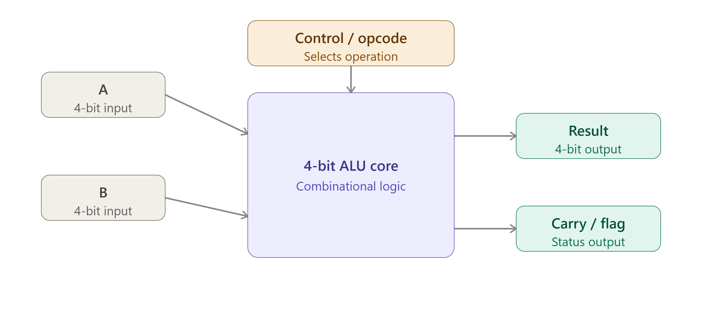
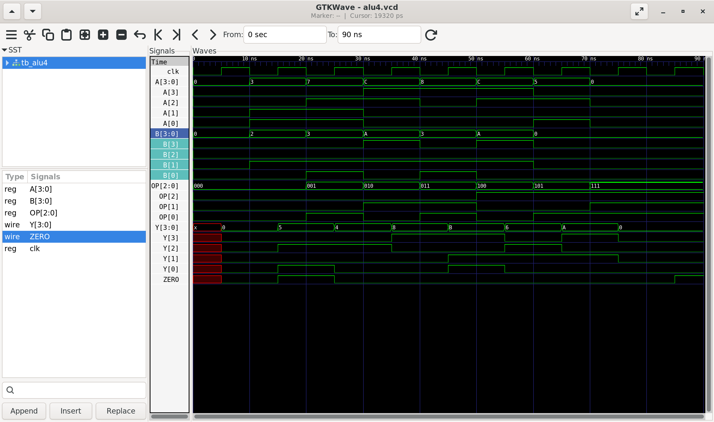
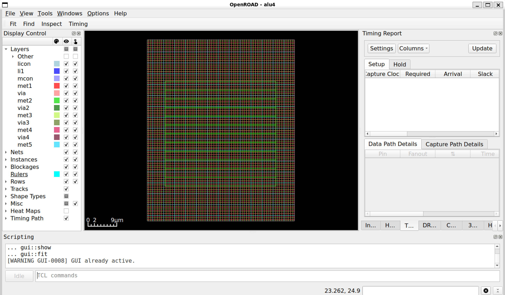
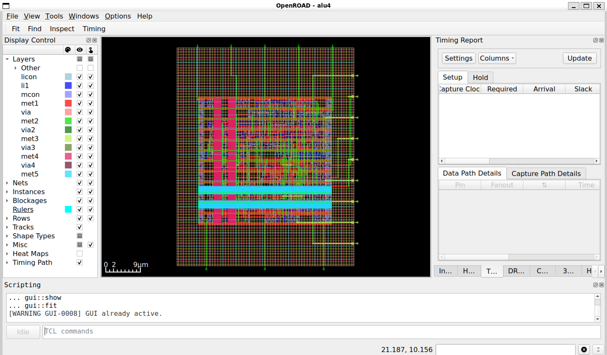
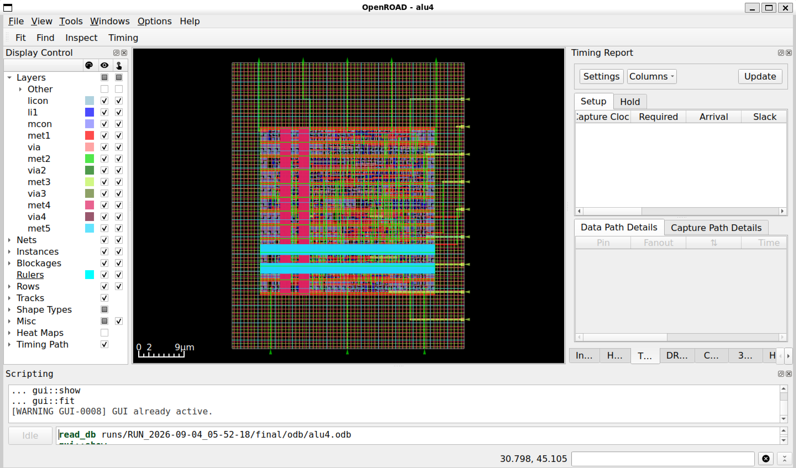
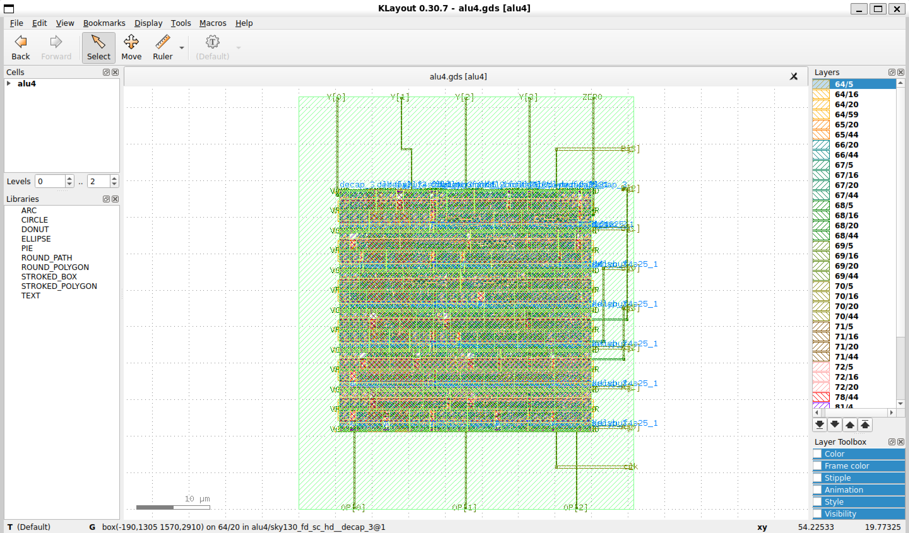

# 4-Bit ALU — RTL-to-GDSII ASIC Implementation

A complete **RTL-to-GDSII implementation of a 4-bit Arithmetic Logic Unit (ALU)** using open-source ASIC design tools and the **SkyWater SKY130A** process design kit.

The project covers RTL design, synthesis, floorplanning, placement, physical design, routing, and final layout generation using an open-source ASIC flow.

---

## 📌 Project Overview

The 4-bit ALU is a combinational digital circuit designed to perform arithmetic and logic operations on two 4-bit input operands.

The RTL was written in **Verilog** and taken through an ASIC physical-design flow using:

**Verilog → Yosys → LibreLane → OpenROAD → KLayout → GDSII**

The objective of this project was to understand how a digital RTL design is transformed into a physically realizable ASIC layout.

---

## 🏗️ Design Flow



---

## 🔧 Technology & Tools

| Category              | Tool / Technology |
| --------------------- | ----------------- |
| HDL                   | Verilog           |
| Synthesis             | Yosys             |
| RTL-to-GDSII Flow     | LibreLane         |
| Physical Design       | OpenROAD          |
| Layout Viewer         | KLayout           |
| PDK                   | SkyWater SKY130A  |
| Standard Cell Library | `sky130_fd_sc_hd` |
| Environment           | Linux / WSL2      |

---

## 🧩 ALU Architecture

The basic architecture consists of:





The ALU processes the input operands according to the selected operation and produces the corresponding 4-bit output.

> Operation encoding should be updated here according to the exact RTL implementation used in this repository.

---

## 💻 RTL Design

The ALU was implemented using synthesizable Verilog RTL.

The design was then synthesized into a gate-level representation using **Yosys** before being passed into the physical-design flow.

---

## 🏭 ASIC Physical Design

The synthesized design was processed through the following physical-design stages:

### 1. Floorplanning

The design area and core region were defined and standard-cell placement rows were generated.

### 2. Placement

Synthesized standard cells were placed within the core area.

### 3. Physical Optimization

The design was prepared for routing using the OpenROAD-based physical-design flow.

### 4. Routing

Metal interconnects were generated to connect the placed standard cells.

### 5. Layout Generation

The final physical design was exported as:

* OpenDB (`.odb`)
* DEF
* GDSII

---

## RTL Simulation



## Physical Design

### Floorplan


### Placement


### Routing


### Final Layout


### GDSII Layout



## 📊 Verified Physical Design Results

The following values were obtained from the completed ALU4 implementation:

| Metric                   |      Result |
| ------------------------ | ----------: |
| Standard cells           |          71 |
| Tap cells                |          14 |
| Fill cells               |         103 |
| Total physical cells     |         188 |
| Standard-cell area       |  785.75 µm² |
| Total physical cell area | 1126.08 µm² |
| Reported design area     |     786 µm² |
| Utilization              |         70% |
| Final ODB                |   Generated |
| Final DEF                |   Generated |
| Final GDSII              |   Generated |

### Important Note

The reported **786 µm² design area should not be interpreted as the die area**. It is the value reported by the OpenROAD design-area report.

Similarly:

* **785.75 µm²** = standard-cell area
* **1126.08 µm²** = total physical cell area
* **786 µm²** = reported design area

---

## ⏱️ Timing & Clock Tree

This ALU is a **purely combinational design** and does not contain registers or flip-flops.

Therefore, a meaningful clock-tree synthesis stage is not applicable to this implementation.

During standalone OpenROAD timing analysis, the following issue was encountered:

```text
[ERROR STA-2141] No liberty libraries found.
```

Therefore, **no timing value is reported in this README** rather than presenting an unverified timing number.

---

## 🔍 Physical Layout

The final physical database can be viewed using OpenROAD:

```bash
openroad -gui
```

Then:

```tcl
read_db runs/RUN_2026-09-04_05-52-18/final/odb/alu4.odb
gui::show
```

The final GDSII can be opened using KLayout:

```bash
klayout runs/RUN_2026-09-04_05-52-18/final/gds/alu4.gds
```

---

## 📁 Project Structure

```text
alu4/
├── src/
│   └── alu4.v
├── config.yaml
├── runs/
│   └── RUN_2026-09-04_05-52-18/
│       └── final/
│           ├── odb/
│           ├── def/
│           └── gds/
├── README.md
└── ...
```

> Update the source-directory structure if the repository uses a different organization.

---

## 🧠 Challenges & Learning

During the implementation, several practical ASIC-flow issues were investigated, including:

* SKY130A PDK configuration
* Standard-cell library setup
* LibreLane configuration
* Floorplanning and utilization
* PDN generation
* OpenROAD database handling
* Physical cell placement
* Routing and layout inspection
* Understanding ODB, DEF and GDSII formats
* Debugging tool and environment issues

One important practical lesson was understanding that an `.odb` file is a binary OpenROAD database and should be loaded using:

```tcl
read_db <file>.odb
```

rather than being treated as a Tcl script.

---

## 🚀 Future Work

Possible extensions include:

* Timing analysis with correctly loaded Liberty libraries
* Power analysis
* DRC verification
* LVS verification
* Area optimization
* Timing optimization
* Power optimization
* Implementation using different SKY130 standard-cell libraries
* Expanding the ALU to 8-bit/16-bit architectures
* Integrating the ALU into a larger datapath
* Designing a small CPU datapath around the ALU

---

## 🎯 Key Takeaway

This project demonstrates the complete transition from **digital RTL to physical ASIC layout** using an open-source EDA toolchain.

It provided practical experience with:

**RTL Design → Logic Synthesis → Floorplanning → Placement → Routing → Physical Database → GDSII**

---

## 👨‍💻 Author

**Aman Mishra**
B.Tech Electronics & Communication Engineering

### Focus Areas

* RTL Design
* Digital VLSI
* ASIC Physical Design
* Verilog
* Open-Source EDA
* Computer Architecture

---

## ⭐ Project Status

**RTL-to-GDSII flow completed successfully for SKY130A.**
